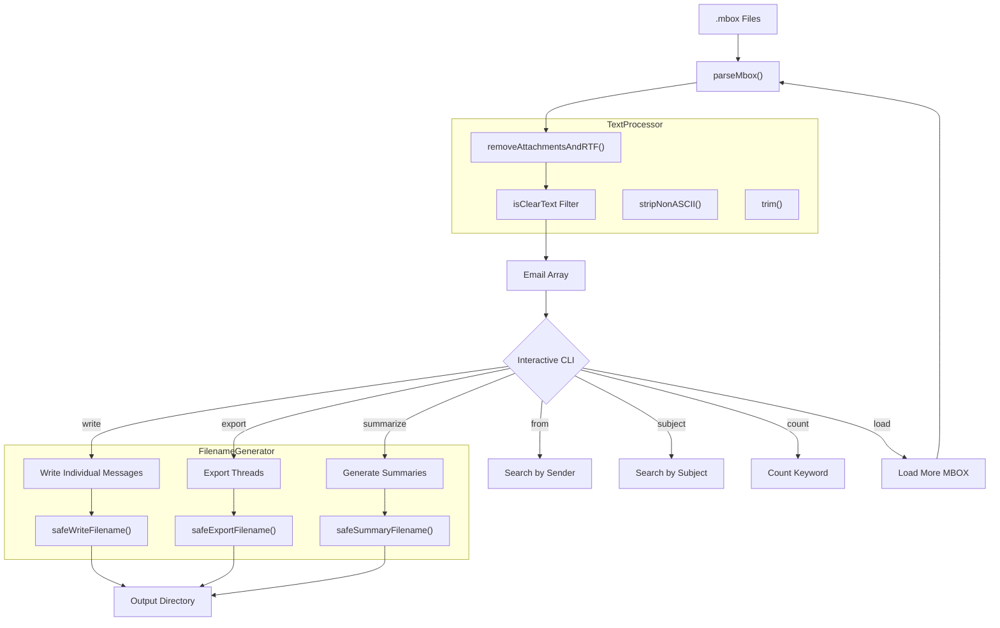

# MboxChatCLI

**Command-line tool for parsing, searching, and exporting MBOX email archives**


[](https://opensource.org/licenses/MIT)


A native macOS command-line tool for parsing, searching, threading, and exporting MBOX email archives. Built in Objective-C with the Foundation framework. No third-party dependencies.

---

## Architecture



---

## Features

| Category | Details |
|----------|---------|
| **MBOX Parsing** | Reads RFC 4155 MBOX files; splits on `\nFrom ` boundaries; extracts From/Subject/Date headers |
| **Multi-File Loading** | Combine multiple archives in one session with the `load` command |
| **RTF Stripping** | Automatic removal of RTF content, MIME attachments, and multipart/mixed sections |
| **Binary Filtering** | Messages failing ASCII validation are silently discarded |
| **Search by Sender** | Case-insensitive substring match on the From header |
| **Search by Subject** | Case-insensitive substring match on Subject |
| **Keyword Count** | Count occurrences of a keyword across all message bodies |
| **Individual Export** | Write each message as a numbered text file (`message0001.txt`, ...) |
| **Thread Export** | Group messages by subject and export each thread as a single file |
| **Thread Summaries** | Generate per-thread metadata: subject, count, first/last sender, date range, opening/closing sentences |
| **Safe Filenames** | Strips non-ASCII, replaces forbidden characters, truncates to 48 chars |

---

## Commands

| Command | Description |
|---------|-------------|
| `load <file>` | Load an additional MBOX file into the session |
| `from <sender>` | Count emails matching a sender |
| `subject <keyword>` | Count emails with keyword in subject |
| `count <keyword>` | Count emails with keyword in body |
| `write <dir>` | Export each message as a separate text file |
| `export <dir>` | Export conversation threads, one file per thread |
| `summarize <dir>` | Generate a summary file for each thread |
| `help` | Show available commands |
| `exit` | Quit |

---

## Usage

```bash
# Launch with one or more MBOX files
MboxChatCLI /path/to/archive.mbox
MboxChatCLI inbox.mbox sent.mbox drafts.mbox

# Interactive session
> from alice@example.com
Found 87 emails from 'alice@example.com'.

> export ~/Desktop/email-threads
[INFO] Exported 342 threads.

> summarize ~/Documents/summaries
[INFO] Wrote summary of 342 threads.

> load /path/to/another.mbox
Now loaded 4200 emails (total).
```

---

## Output Formats

**Individual messages** (`write`): From/Subject/Date headers followed by ASCII body.

**Thread exports** (`export`): All messages sharing the same subject collected into a single file, sorted chronologically.

**Thread summaries** (`summarize`): Subject, message count, first and last sender with dates, opening and closing sentences.

---

## Requirements

- macOS 14.0 or later
- Xcode 15.0+ (build from source)

---

## Build

```bash
git clone git@github.com:kochj23/MboxChatCLI.git
cd MboxChatCLI
open MboxChatCLI.xcodeproj
# Cmd+B to build
```

Or from the command line:

```bash
xcodebuild build -project MboxChatCLI.xcodeproj \
  -scheme MboxChatCLI -configuration Release -derivedDataPath build
cp build/Build/Products/Release/MboxChatCLI /usr/local/bin/
```

Zero external dependencies. Foundation framework only.

**Codebase:** 7 source files, ~870 lines of Objective-C.

---

## Test Suite

132 XCTest cases across 2 test files.

| Category | Tests | Description |
|----------|-------|-------------|
| Email Model | 6 | Init, values, nil, description, copy semantics |
| TextProcessor | 12 | isClearText, stripNonASCII, removeRTF, trim, sentence extraction |
| FilenameGenerator | 7 | Write, export, summary filenames; special chars; truncation |
| C Functions | 6 | Direct tests of main.m public functions |
| MBOX Parsing | 5 | Basic parse, headers, not found, empty, multi-email |
| Thread Sentences | 4 | First/last sentence extraction, empty thread handling |
| Functional | 2 | End-to-end parse+write, RTF stripping pipeline |
| Security | 7 | Path traversal, null bytes, long input, XSS, binary injection |
| Comprehensive | 77 | Extended coverage of all modules and edge cases |
| Directory | 6 | Directory creation, permissions, nested paths |
| **Total** | **132** | |

```bash
xcodebuild test -scheme MboxChatCLI -sdk macosx \
  -destination "platform=macOS"
```

---

## Technical Details

- **Parsing:** Splits on `\nFrom ` (RFC 4155), extracts headers by prefix matching, strips MIME after first blank line.
- **Threading:** Groups by lowercased subject string, sorted chronologically.
- **Memory:** All emails loaded into `NSMutableArray`. For archives exceeding available RAM, split the file first.
- **Limitations:** No Message-ID/In-Reply-To threading, no HTML rendering, no attachment extraction, no regex search, no JSON/CSV export.

---

## Project Structure

```
MboxChatCLI/
  main.m                        -- Entry point, parser, command loop
  Models/
    Email.h / Email.m           -- Email data model
  Utilities/
    TextProcessor.h / .m        -- ASCII validation, stripping, RTF removal
    FilenameGenerator.h / .m    -- Safe filename generation
```

---

## License

MIT License. See [LICENSE](LICENSE).

Copyright (c) 2025 Jordan Koch.

---

Written by **Jordan Koch** ([@kochj23](https://github.com/kochj23))
