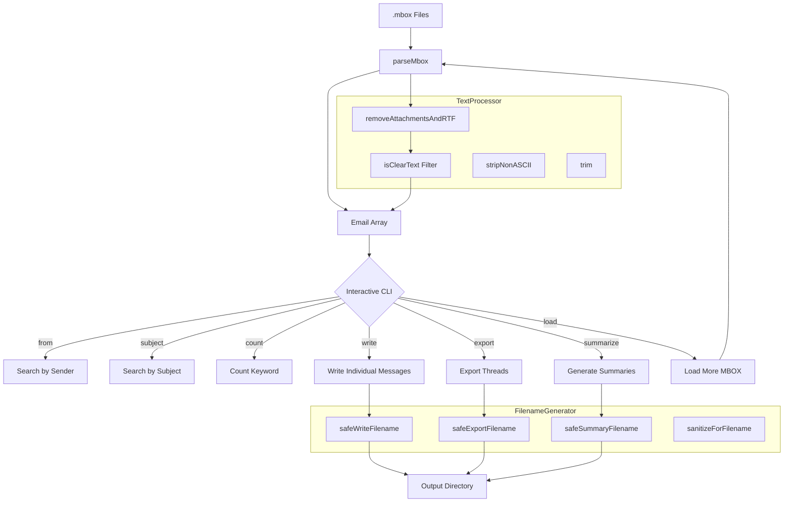

# MboxChatCLI


[](LICENSE)


A native macOS command-line tool for parsing, searching, threading, and exporting MBOX email archives. Built in Objective-C with the Foundation framework -- no third-party dependencies.

---

## Architecture

```
+------------------------------------------------------------------+
|                          MboxChatCLI                             |
+------------------------------------------------------------------+
|                                                                  |
|   +-----------------+    +-------------------+                   |
|   |   main.m        |    |  Interactive CLI   |                  |
|   |  (entry point)  |--->|  Command Loop      |                  |
|   +-----------------+    +--------+----------+                   |
|                                   |                              |
|          +------------------------+------------------------+     |
|          |            |           |           |             |     |
|          v            v           v           v             v     |
|   +-----------+ +-----------+ +--------+ +---------+ +---------+ |
|   | parseMbox | | from      | | write  | | export  | |summarize| |
|   | (parser)  | | subject   | | (msgs) | |(threads)| |(threads)| |
|   +-----------+ | count     | +--------+ +---------+ +---------+ |
|        |        | (search)  |      |          |            |     |
|        v        +-----------+      +----------+------------+     |
|   +-----------+       |            |                             |
|   |  Email    |       v            v                             |
|   |  Model    |  +------------+  +-----------------+             |
|   | (Email.h) |  |  Text      |  |  Filename       |            |
|   | (Email.m) |  |  Processor |  |  Generator      |            |
|   +-----------+  +------------+  +-----------------+             |
|                  | isClearText |  | safeExportName  |            |
|                  | stripNonASCII| | safeWriteName   |            |
|                  | removeRTF   | | safeSummaryName  |            |
|                  | trim        | | sanitize         |            |
|                  +------------+  +-----------------+             |
|                                                                  |
+------------------------------------------------------------------+
         |                                        |
         v                                        v
  +-------------+                        +------------------+
  | .mbox files |                        | Output Directory |
  | (RFC 4155)  |                        | message0001.txt  |
  +-------------+                        | export *.txt     |
                                         | summary *.txt    |
                                         +------------------+
```

### Data Flow

```
.mbox file(s) --> parseMbox() --> [Email] array --> Command Loop
                                                       |
                      +------------+-------------------+------------------+
                      |            |                   |                  |
                   search       write             export             summarize
                   (stdout)   (1 file/msg)     (1 file/thread)    (1 summary/thread)
```

Emails flow through a three-stage pipeline: **parse** (split MBOX into messages, extract headers, strip attachments and RTF), **store** (hold in an `NSMutableArray` of `Email` objects), and **act** (search, filter, or export via the interactive command loop).

---

## Features

**Parsing**
- Reads standard MBOX format files (RFC 4155)
- Multi-file loading -- combine several archives in one session
- Automatic stripping of RTF content, MIME attachments, and multipart/mixed sections
- Filters out binary-encoded messages, keeping only clean ASCII text

**Search**
- Search by sender (`from`) -- case-insensitive substring match
- Search by subject keyword (`subject`) -- case-insensitive substring match
- Count keyword occurrences in message bodies (`count`)

**Export**
- Write individual messages as numbered text files (`message0001.txt`, `message0002.txt`, ...)
- Export entire conversation threads grouped by subject, each as a single file
- Generate per-thread summary files with metadata: subject, message count, first/last sender, date range, opening and closing sentences

**Text Processing**
- ASCII validation and conversion for maximum output compatibility
- Non-printable and non-ASCII character stripping
- Safe filename generation with forbidden-character replacement and 48-character truncation

---

## Installation

### Requirements

- macOS 10.13 (High Sierra) or later
- Xcode 14.0 or later (for building from source)

### Build from Source

Clone and build with Xcode:

```bash
git clone https://github.com/kochj23/MboxChatCLI.git
cd MboxChatCLI
open MboxChatCLI.xcodeproj
```

Build the project with Cmd+B. The compiled binary lands in:

```
build/Release/MboxChatCLI
```

Or build from the command line:

```bash
xcodebuild build \
  -project MboxChatCLI.xcodeproj \
  -scheme MboxChatCLI \
  -configuration Release \
  -derivedDataPath build
```

### Install the Binary

Copy the built binary to a location on your PATH:

```bash
cp build/Release/MboxChatCLI /usr/local/bin/
```

---

## Usage

### Launch

Pass one or more MBOX files as arguments:

```bash
MboxChatCLI /path/to/archive.mbox
MboxChatCLI inbox.mbox sent.mbox drafts.mbox
```

Or launch without arguments for interactive file entry:

```bash
MboxChatCLI
Enter path(s) to .mbox files (comma-separated): /path/to/archive.mbox
```

### Commands

Once emails are loaded, the interactive prompt accepts these commands:

| Command | Description |
|---|---|
| `load <file>` | Load an additional MBOX file into the current session |
| `from <sender>` | Count emails matching a sender (case-insensitive) |
| `subject <keyword>` | Count emails with keyword in subject line |
| `count <keyword>` | Count emails with keyword in body text |
| `write <dir>` | Export each message as a separate text file |
| `export <dir>` | Export conversation threads, one file per thread |
| `summarize <dir>` | Generate a summary file for each thread |
| `help` | Show available commands |
| `exit` | Quit the application |

### Examples

Search for all emails from a specific person:

```
> from alice@example.com
Found 87 emails from 'alice@example.com'.
```

Export all threads to a directory (created automatically if it does not exist):

```
> export ~/Desktop/email-threads
[INFO] Exported 342 threads (each as a single file named 'export ...').
```

Generate thread summaries:

```
> summarize ~/Documents/summaries
[INFO] Wrote summary of 342 threads.
```

Load a second archive mid-session:

```
> load /path/to/another.mbox
Now loaded 4200 emails (total).
```

---

## Output Formats

### Individual Messages (`write`)

```
From: john@example.com
Subject: Project Update
Date: Mon, 15 Jan 2024 09:23:45 -0800

Email body content (ASCII only, attachments removed)
```

### Thread Export (`export`)

```
----- Email #1 -----
From: john@example.com
Subject: Project Update
Date: Mon, 15 Jan 2024 09:23:45 -0800

First message body

----- Email #2 -----
From: alice@example.com
Subject: Re: Project Update
Date: Mon, 15 Jan 2024 14:30:12 -0800

Reply body
```

### Thread Summary (`summarize`)

```
Subject: Project Update
Thread length: 5 message(s)
From: john@example.com (Mon, 15 Jan 2024 09:23:45 -0800)
To:   alice@example.com (Wed, 17 Jan 2024 16:45:00 -0800)
Thread began: We need to discuss the project timeline
Thread ended: Sounds good, let's meet Thursday at 2pm
```

---

## Technical Details

### Source Structure

```
MboxChatCLI/
    MboxChatCLI/
        main.m                          -- Entry point, MBOX parser, command loop
        Models/
            Email.h / Email.m           -- Email data model (from, subject, date, body)
        Utilities/
            TextProcessor.h / .m        -- ASCII validation, stripping, RTF removal
            FilenameGenerator.h / .m    -- Safe filename generation with sanitization
        CLI/                            -- (reserved for future CLI module extraction)
        Commands/                       -- (reserved for future command classes)
        Parsers/                        -- (reserved for future parser extraction)
    MboxChatCLI.xcodeproj/
    .github/
        workflows/
            build.yml                   -- CI build on macOS 14 (Xcode latest-stable)
```

**~870 lines of Objective-C** across 7 source files.

### MBOX Parsing Strategy

The parser splits the entire file on `"\nFrom "` boundaries (the standard MBOX separator per RFC 4155). For each chunk it extracts `From:`, `Subject:`, and `Date:` headers by prefix matching, then treats everything after the first blank line as the body. The body passes through `removeAttachmentsAndRTF()` to strip MIME parts, and messages that fail `isClearText()` validation (contain non-ASCII binary data) are silently discarded.

### Thread Grouping

Threads are grouped by lowercased subject string. All messages sharing the same subject (after case-folding) are collected into a single thread array, then sorted chronologically by date string for export and summary generation.

### Filename Safety

Exported filenames are sanitized by:
1. Stripping all non-ASCII characters
2. Replacing forbidden filesystem characters (`/ \ : ? % * | " < > '`) with underscores
3. Truncating to 48 characters maximum
4. Falling back to `threadNNNN` if the subject is empty or fully sanitized away

### Memory Model

All emails are loaded into memory as an `NSMutableArray<Email *>`. For archives exceeding available RAM (typically >2-4 GB depending on system memory), split the MBOX file before processing.

---

## Architecture (Mermaid)



---

## Test Coverage

| Category | Tests | Description |
|----------|-------|-------------|
| Email Model | 6 | Init, values, nil, description, copy semantics |
| TextProcessor | 12 | isClearText, stripNonASCII, removeRTF, trim, sentences |
| FilenameGenerator | 7 | Write, export, summary, special chars, truncation |
| C Functions | 6 | Direct tests of main.m public functions |
| MBOX Parsing | 5 | Basic parse, headers, not found, empty, multi-email |
| Thread Sentences | 4 | First/last sentence from thread, empty thread |
| Functional | 2 | End-to-end parse+write, RTF stripping pipeline |
| Security | 7 | Path traversal, null bytes, long input, XSS, binary |
| **Total** | **49** | |

---

## Limitations

- Entire MBOX file is loaded into memory -- not suitable for multi-gigabyte archives on low-memory systems
- Thread detection uses subject matching only (does not use Message-ID, In-Reply-To, or References headers)
- No HTML rendering -- HTML emails are exported as raw markup
- No attachment extraction -- binary attachments are stripped, not saved
- No date range filtering
- Search uses case-insensitive substring matching only (no regex)
- No JSON or CSV export format

---

## CI/CD

The project uses GitHub Actions for continuous integration. Every push and pull request to `main` or `master` triggers a build on macOS 14 with the latest stable Xcode. See `.github/workflows/build.yml`.

---

## License

MIT License. Copyright (c) 2025 Jordan Koch. See [LICENSE](LICENSE) for the full text.

---

## Contributing

Issues and pull requests are welcome. When reporting a bug, include your macOS version, MBOX file size, steps to reproduce, and expected versus actual behavior. See [CONTRIBUTING.md](CONTRIBUTING.md) for guidelines.

---

Written by Jordan Koch ([kochj23](https://github.com/kochj23)).
